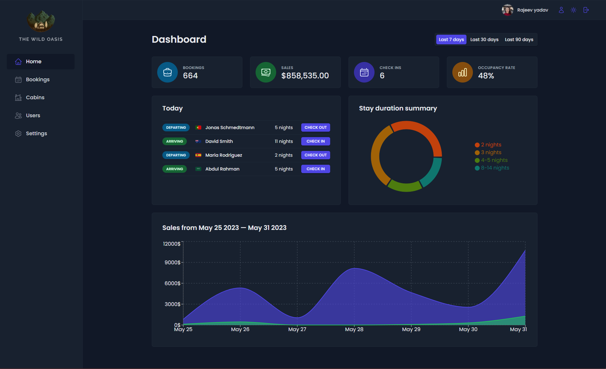
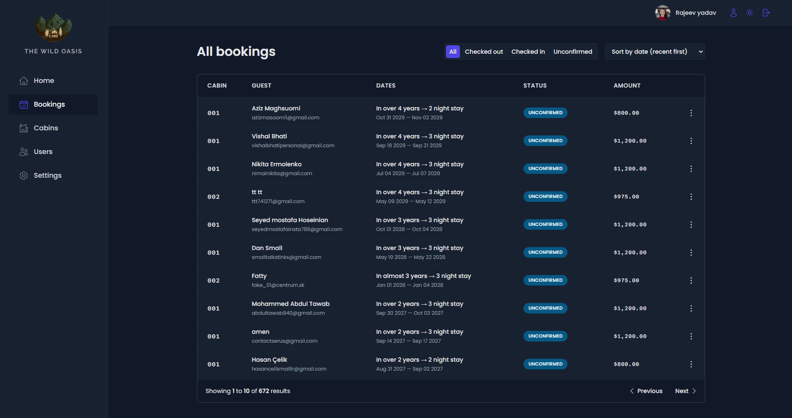

# The Wild Oasis

This project was created as part of a **React development** Udemy course.
It focuses on building a modern **application** with real-world tools, including **state management, data fetching, and UI styling**.

## 🚀 Features
- **React & Styled Components** – Modern UI with component-based styling.
- **State Management** – Uses **Redux** for global state handling.
- **Data Fetching with React Query** – Optimized API calls and caching for better performance.
- **Supabase Backend** – Real **NoSQL database** with authentication.
- **Fully Responsive** – Mobile-friendly and accessible design.

## 📅 Project Details
- **Course**: Udemy - The Ultimate React Course 2023: React, Next.js, Redux & More
- **Year**: 2023
- **Technologies**: React, Styled Components, React Query, Redux, Supabase

## 📸 Preview  

---

⭐ This was a learning project and is not actively maintained.
